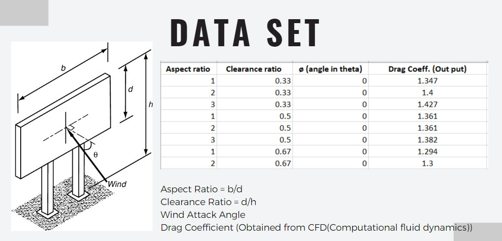

<!-----
layout: home
permalink: index.html

# Please update this with your repository name and title
repository-name: eYY-XXX-project-template
title:
---
-->
[comment]: # "This is the standard layout for the project, but you can clean this and use your own template"

# Prediction of Drag Force Coefficient for Single-Column Supported Billboard Structure using ML
---

<!-- 
This is a sample image, to show how to add images to your page. To learn more options, please refer [this](https://projects.ce.pdn.ac.lk/docs/faq/how-to-add-an-image/)

 -->

## Team
-  E/18/017, Aarah J.F., [e18017@eng.pdn.ac.lk](mailto:e18017@eng.pdn.ac.lk)
-  E/18/177, Khan A.K.M.S., [e18177@eng.pdn.ac.lk](mailto:e18177@eng.pdn.ac.lk)
-  E/18/304, Rishad N.M., [e18304@eng.pdn.ac.lk](mailto:e18304@eng.pdn.ac.lk)

## Table of Contents
1. [Introduction](#introduction)

---
## Introduction

 Billboards play a crucial role in advertising and marketing, but their structural integrity and stability are paramount to ensure public safety. These large structures are exposed to varying wind loads, making it essential to analyze and predict their performance under different wind conditions. Our project, "ML for Structural Health Monitoring: Prediction of Drag Force Coefficient for Single-Column-Supported Billboard," focuses on developing a machine learning-based solution to accurately predict the drag force coefficient, a critical parameter for assessing billboard stability.

The aim of our project is to leverage the power of machine learning techniques to create a model that can predict the drag force coefficient for single-column-supported billboards. By analyzing the forces acting on the structure, we can provide insights into its structural safety and help optimize its design for efficiency and cost-effectiveness.

## Importance of Analysis

 Analyzing billboards ensures their safety and compliance, optimizing their design and mitigating risks. Our project leverages modern analysis techniques and machine learning to revolutionize billboard engineering. By evaluating structural integrity, assessing wind load resistance, and complying with regulations, we create efficient and economical designs. Our innovative approach addresses outdated practices, enhancing accuracy and reliability. Join us in building a safer, more effective advertising infrastructure with enhanced structural integrity and reduced failure rates.

## Why drag force coefficient?

 The drag force coefficient is a critical factor that directly impacts the health and stability of single-column billboard structures. Accurately predicting this coefficient is essential for ensuring the safety and durability of these structures. By understanding the drag force coefficient, engineers can assess the level of resistance the structure will encounter when exposed to wind loads. This information allows for the optimization of design parameters, such as dimensions and materials, to ensure that the structure can withstand the forces acting upon it. By accurately predicting the drag force coefficient, we can make informed decisions and implement measures to enhance the structural integrity and overall health of single-column billboard structures, minimizing the risk of damage or collapse.
 
 
## Motivation

 The motivation behind our project is driven by two key factors: the prevention of accidents or damage to property and life, and the optimization of material and resource usage.
<ul>
<li>Prevent accidents or damage to property and life: By accurately predicting the drag force coefficient for single-column billboard structures, we aim to enhance their structural integrity and safety. Accurate predictions enable us to design billboards that can withstand wind loads, reducing the risk of accidents or structural failures that could cause damage to property and, most importantly, threaten human lives. Our goal is to contribute to a safer built environment by providing reliable and precise information for the design and maintenance of billboard structures.</li>

<li>Ensure optimized usage of material and resources: By understanding the drag force coefficient and its influence on billboard structures, we can optimize the design and usage of materials and resources. This optimization leads to more efficient and cost-effective designs, minimizing material wastage and maximizing the utilization of resources. By employing accurate predictions, we can strike a balance between structural safety and economic efficiency, creating sustainable billboard structures that meet safety standards while reducing unnecessary resource consumption.</li></ul>
 

## Solution
 
 The proposed solution involves addressing the limitations of existing regression models and developing a machine learning-based predictive model for accurately predicting the drag force coefficient of single-column billboard structures. Here is an outline of the solution:
<ul>
<li>Identify limitations of existing regression models: The first step is to analyze the shortcomings of the current regression models used for predicting drag force coefficients. This analysis helps us understand their limitations, such as inaccuracies or inefficiencies, and guides us in developing an improved solution.</li>

<li>Develop an ML-based predictive model: Leveraging machine learning techniques, we develop a predictive model specifically designed for estimating the drag force coefficient of single-column billboard structures. This model utilizes algorithms capable of capturing complex relationships between input parameters (such as dimensions, aspect ratio, clearance ratio, and angle) and drag force coefficients. By training the model on a dataset consisting of input parameters and corresponding drag force coefficients obtained from computational fluid dynamics (CFD) simulations, the model learns to make accurate predictions.</li>

<li>Train the model on the dataset: The developed ML model is trained using the dataset obtained from CFD simulations. The training process involves feeding the model with input parameters and their corresponding drag force coefficients. Through an iterative process, the model adjusts its internal parameters to minimize the prediction errors and improve its accuracy in estimating the drag force coefficient.</li>

<li>Validate the model against existing regression models: To assess the accuracy and efficiency of the ML-based predictive model, it is validated against the existing regression models. This validation involves comparing the model's predictions with the results obtained from the regression models. The performance of the ML model is evaluated based on metrics such as accuracy, precision, and efficiency.</li></ul>

By addressing the limitations of existing regression models and developing an ML-based predictive model trained on a dataset of CFD simulations, we aim to provide a more accurate and efficient solution for predicting the drag force coefficient of single-column billboard structures.

## DataSet
The Dataset consists of input parameters and corresponding drag force coefficients for single-column billboards. The input parameters include aspect ratio, clearance ratio, angle (in theta), and the output is the drag coefficient.

Breakdown of the dataset:
<ul>
<li>Aspect ratio: The aspect ratio describes the proportional relationship between the width and height of the billboard.</li>
<li>Clearance ratio: The clearance ratio represents the ratio of the distance between the bottom of the billboard and the ground to the height of the billboard.</li>
<li>Angle (in theta): The angle refers to the inclination or tilt of the billboard from the vertical position.</li>
<li>Drag coefficient: The drag coefficient quantifies the resistance experienced by the billboard due to wind forces.</li></ul>

The dataset contains various combinations of these parameters, providing a range of scenarios for training and evaluating the predictive model. The dataset includes different aspect ratios, clearance ratios, angles, and corresponding drag coefficients.

## Links

- [Project Repository](https://github.com/cepdnaclk/{{ page.repository-name }}){:target="_blank"}
- [Project Page](https://cepdnaclk.github.io/{{ page.repository-name}}){:target="_blank"}
- [Department of Computer Engineering](http://www.ce.pdn.ac.lk/)
- [University of Peradeniya](https://eng.pdn.ac.lk/)

[//]: # (Please refer this to learn more about Markdown syntax)
[//]: # (https://github.com/adam-p/markdown-here/wiki/Markdown-Cheatsheet)
